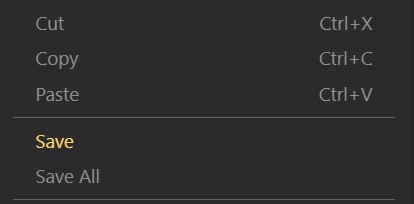

# Save From Context Menu

This extension simply adds a 'Save' and 'Save All' option to your context menu from within the editor. Forget Ctrl-S, this is better.

## Screenshot

## Github Link
https://github.com/kosmos434/vscode-context-save

###### 💾